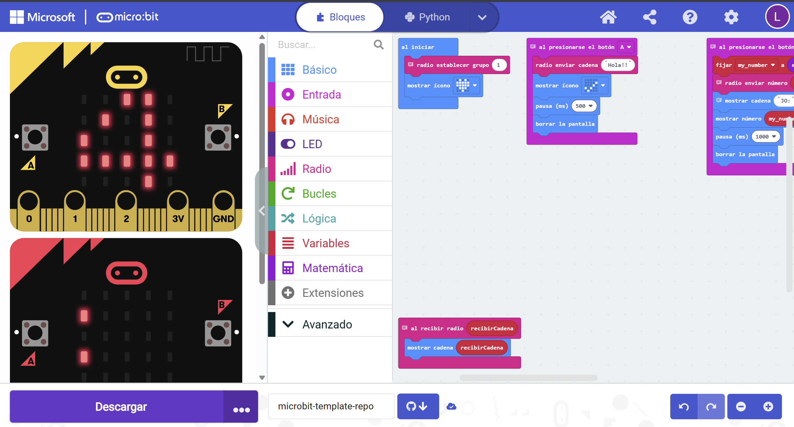

# Joc i missatges per ràdio amb Micro:bit

Permet **enviar missatges** i **jugar als daus** entre micro:bits utilitzant la ràdio.

## Inici

En engegar el micro:bit es mostra un **cor**, indicant que està a punt.
Els dispositius han d’estar al **mateix grup de ràdio (1)**.

## Enviar un missatge (Botó A)

Prem **A** per enviar el text **“Hola!!”**.
El micro:bit mostra una icona de confirmació i s’esborra la pantalla.

## Jugar als daus (Botó B)

Prem **B** per:

1. Generar un nombre aleatori del **1 al 6**.
2. Enviar-lo per ràdio.
3. Mostrar el teu resultat (**JO:**).

Quan rebi el número de l’altre micro:bit (**ELL:**), es compara:

* Si el seu número és més alt → *has perdut*
* Si és més baix → *has guanyat*
* Si és igual → *empat*

## Rebre missatges de text

Si arriba un text per ràdio, el micro:bit el mostra directament a la pantalla.

